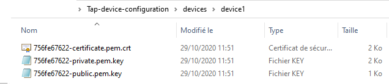
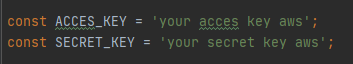

 ## AWS production script
The purpose of this aws production script is to simulate a configuration launch on multiple tap.
 
 ## Requirements  
 
 #### AWS requirements 
 - For this simulation you need an aws iot core account.
 - You will need a list of device.
 - Each device has the same type defined in iot core.
 - On this example the type name will be "TAP-LINK-CONFIG".
 - Add a single device folder for each tap that needs to be configured.
 - In each device file add the certificates generated by aws iot:
  
 
 #### Node requirements
 
 - You must have node package manager to install the dependencies related to this project.
 - Run command npm install to add dependencies.

    npm i

 ## Basic Configuration
 - In the index.js file set the aws key:
   
 - By default the tap is configured with the same tap wep key.
 
 ## Running this example
 Place yourself in the root of the project and run the following command:
 
    ts-node index.ts
 
 ## Method list
 
 #### start()
 First this method checks the aws connection, then it launches a search of the available objects on the aws iot core account.
 Subsequently it launches the getListThingsWithConfigType() method with the list of found objects as parameters.
 
 #### getListThingsWithConfigType()
 This method starts by filtering found objects and retrieves those that have the right type.
 Then we will define the parameters of the certFile to configure the tap.
 Once the device parameter list is ready the getTapList() method is launched.
 
 #### getTapList()
 A wifi search available is found and sorted by name "TP-LINK" to retrieve only the tap.
 For each tap found on settings the wifi information and the options to configure in the tap.
 
 #### tapConnectAndConfig()
 The method will allow each tap to connect to its wifi and then connect to the tap and configure it.